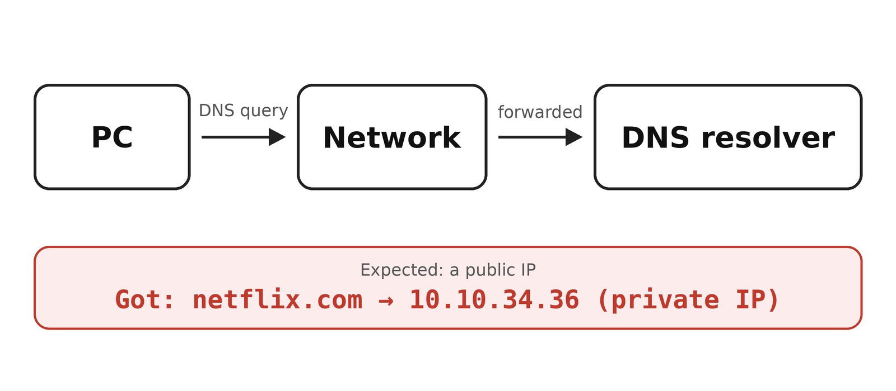
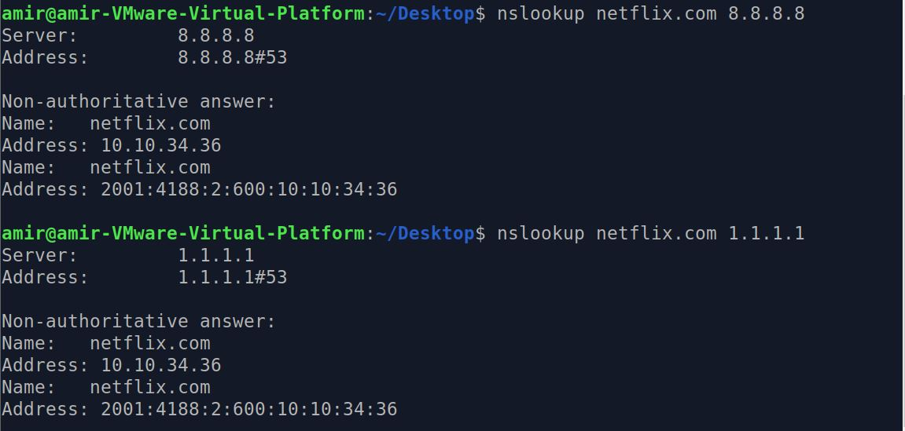
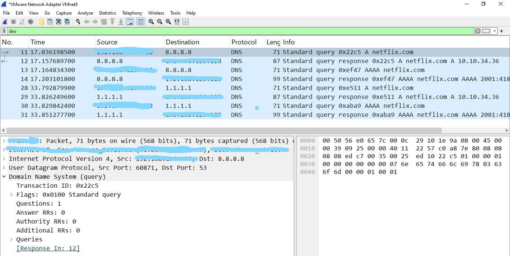
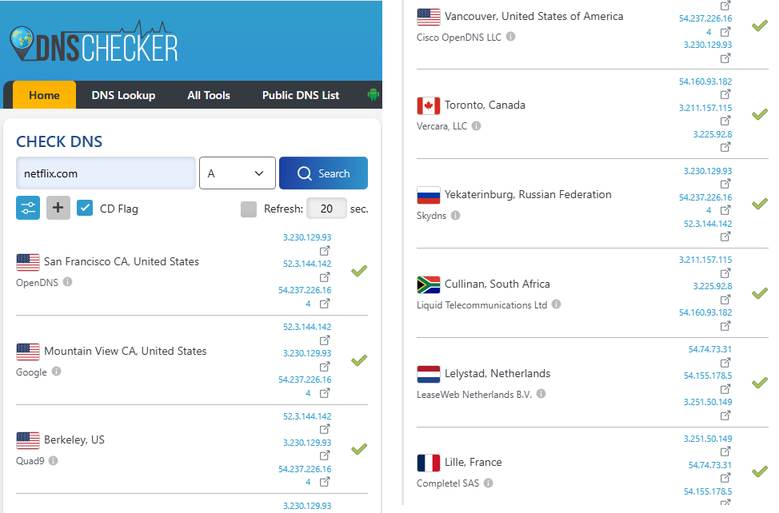

# 🌐 A Public Domain Resolved to a Private IP

🔍 A technical analysis of unusual DNS resolution behavior observed during a networking exercise.


---

## 📋 Overview

I was practicing network commands (`nslookup`, `dig`) as part of a networking course. At first everything looked normal. Then I tried a few other domains, `netflix.com` among them, just to see how resolution behaves.

Before running `nslookup`, I opened Wireshark so I could watch the queries and responses.

---

## 🔧 Method

The setup is simple:



I queried `netflix.com` against two well-known public resolvers:

```
nslookup netflix.com 8.8.8.8
nslookup netflix.com 1.1.1.1
```

Both returned:

```
10.10.34.36
```

That is a private IP range (`10.0.0.0/8`, RFC 1918). It should not be the answer for a public domain.



### Extra test: an address with no real DNS server

To check whether the answers really came from those resolvers, I queried `192.0.2.1`. This address belongs to TEST-NET-1 (RFC 5737), a range reserved for documentation, so no real DNS server should exist there.

```
nslookup netflix.com 192.0.2.1
```

It answered anyway, with the same `10.10.34.36`.

---

## 🔍 Wireshark Analysis

I captured the DNS traffic and filtered it with `dns`. The red box marks the queries sent to `192.0.2.1`.



The IPv6 response was also interesting:

```
2001:4188:2:600:10:10:34:36
```

The tail (`10:10:34:36`) matches the IPv4 answer. That does not look like a coincidence.

Response times for the A query, as seen in my capture:

| Destination | Response time |
| ----------- | ------------- |
| 8.8.8.8     | ~22 ms        |
| 1.1.1.1     | ~3.7 ms       |
| 192.0.2.1   | ~2.5 ms       |

The non-existent server answered in about 2.5 ms, faster than 8.8.8.8 and similar to 1.1.1.1. I did not investigate timing further, so I treat this as an observation, not as proof.

---

## 🌍 External Verification

To double-check, I used `dnschecker.org`. From other locations, `netflix.com` resolved to its normal public IPs, completely different from what I got.



---

## 📊 Observations

- `8.8.8.8` and `1.1.1.1` returned the same private IP.
- `192.0.2.1`, an address where no real DNS server should exist, also answered with the same private IP.
- The IPv6 response mirrored the IPv4 result.
- From other locations, the correct public IPs were returned.

These observations suggest that **something on the path between my machine and the destination is answering or altering DNS responses**, regardless of the destination address. I did not identify what it is.

---

## ❓ Open Questions

- What exactly answers these queries? A transparent DNS proxy, or something else?
- Would DNSSEC validation have detected this? (Not tested)
- Does the same happen for other domains?
- What would `dig +trace` show from this network? (Not tested)

---

## 🤖 Why This Matters for IoT and Robotics

If DNS answers can be rewritten silently, any device that trusts DNS (sensors, robots, controllers) can be pointed at the wrong server. In a multi-robot setup, one wrong DNS answer could break coordination between nodes.

Many IoT devices use plain, unauthenticated DNS and cannot easily switch to DoH, so DNS integrity is a safety concern, not just a networking one.

---

## 🛠️ Environment

| Component   | Details                                    |
| ----------- | ------------------------------------------ |
| 🖥️ Machine   | Linux VM (VMware)                          |
| 🌐 Network   | A network I was testing from               |
| 🦈 Wireshark | 4.x, capturing on VMware Network Adapter VMnet8 |
| 🔍 nslookup  | Built-in                                   |
| 📡 dig       | Not used                                   |

---

## 📁 Files

| File | Description |
| ---- | ----------- |
| 📄 [nslookup.txt](outputs/nslookup.txt) | Raw terminal output from the DNS queries |

---

## 📚 References

- RFC 1918: Address Allocation for Private Internets
- RFC 5737: IPv4 Address Blocks Reserved for Documentation
- RFC 4033: DNS Security Introduction and Requirements
- Wireshark Documentation
- dnschecker.org

---

## 👤 Author

**Amir Moghaddas**
Computer Engineering Student | IoT & Robotics Enthusiast

- LinkedIn: [linkedin.com/in/amir-moghaddas-027990388](https://www.linkedin.com/in/amir-moghaddas-027990388)
- GitHub: [github.com/Amir-moghaddas](https://github.com/Amir-moghaddas)
